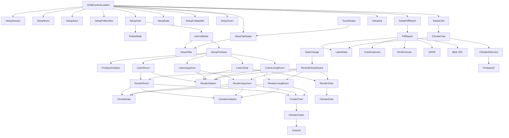

# DEPENDENCY_MAP

## Diagrama Geral

```mermaid
graph TD
    HTML[index.html] --> Config[AppConfig]
    HTML --> Assets[ClimateAssets]
    HTML --> Data[ClimateData]
    HTML --> Analytics[ClimateAnalytics]
    HTML --> Solar[ClimateSolar]
    HTML --> Charts[ClimateCharts]
    HTML --> Aqi[ClimateAqi]
    HTML --> Season[ClimateSeason]
    HTML --> Moon[ClimateMoon]
    HTML --> Firebase[FirebaseService]
    HTML --> Auth[ClimateAuthService]
    HTML --> BrowserLocation[BrowserLocationService]
    HTML --> ExternalWeather[ExternalWeatherService]
    HTML --> Chat[ClimateChat]
    HTML --> UI[ClimateUI]
    HTML --> Zoom[ClimateZoom]
    HTML --> Pdf[ClimatePdfReport]
    HTML --> Quarto[QuartoView]
    HTML --> Aquario[AquarioView]
    HTML --> Sala[SalaView]
    HTML --> SolarView[SolarView]
    HTML --> Estacao[EstacaoView]
    HTML --> PublicView[PublicWeatherView]
    HTML --> Main[scripts/main.js]

    Main --> Config
    Main --> Assets
    Main --> Data
    Main --> Analytics
    Main --> Solar
    Main --> Charts
    Main --> Aqi
    Main --> Season
    Main --> Moon
    Main --> Firebase
    Main --> Auth
    Main --> BrowserLocation
    Main --> ExternalWeather
    Main --> Chat
    Main --> UI
    Main --> Zoom
    Main --> Pdf
    Main --> Quarto
    Main --> Aquario
    Main --> Sala
    Main --> SolarView
    Main --> Estacao
    Main --> PublicView

    Firebase --> FirebaseSDK[Firebase SDK CDN]
    Auth --> Firebase
    Auth --> FirebaseAuth[Firebase Auth]
    PublicView --> BrowserLocation
    PublicView --> ExternalWeather
    PublicView --> Assets
    PublicView --> Charts
    PublicView --> Solar
    PublicView --> Season
    PublicView --> Moon
    ExternalWeather --> BrasilAPI[BrasilAPI/ViaCEP]
    ExternalWeather --> OpenMeteo[Open-Meteo Forecast/Air Quality/Geocoding]
    Firebase --> AppCheck[Firebase App Check]
    AI --> Firebase
    AI --> FirebaseAI[Firebase AI Logic]
    Chat --> AI
    Chat --> Data
    Chat --> Solar
    Chat --> Aqi
    Quarto --> Data
    Quarto --> Analytics
    Quarto --> Charts
    Sala --> Data
    Sala --> Analytics
    Sala --> Charts
    Aquario --> Data
    Aquario --> Analytics
    Aquario --> Charts
    SolarView --> Data
    SolarView --> Solar
    Assets --> ChartJS[Chart.js]
    Assets --> PdfModules[scripts/reports/pdf-report-*]
    Assets --> AssistantModules[scripts/assistant/*]
    Charts --> ChartJS
    Aqi --> LivingRoomData[historico/AirQuality]
    Season --> Data
    Moon --> Data
    Estacao --> Data
    Estacao --> Charts
    Estacao --> SolarView
    Estacao --> Aqi
    Estacao --> Season
    Estacao --> Moon
    Solar --> ChartJS
    Zoom --> ChartJS
    Pdf --> Html2Canvas[html2canvas]
    Pdf --> JsPDF[jsPDF]
    Pdf --> Data
    Pdf --> ChartJS
```

## index.html

Responsabilidade: definir DOM, containers, abas, canvases e ordem dos scripts.

Dependencias diretas: scripts locais essenciais, Google Fonts, `style.css` e preload nao bloqueante de `styles/chat.css`.

Dependencias indiretas: todas as dependencias dos scripts. Chart.js, modulos do PDF e modulos da assistente entram por `scripts/runtime-loader.js` quando necessarios.

Quem chama: navegador.

Quem e chamado: todos os scripts.

Impacto da alteracao: Critico. IDs e ordem dos scripts afetam toda a aplicacao.

## package.json

Responsabilidade: expor comandos locais de manutencao.

Dependencias diretas: Node.js local.

Quem chama: desenvolvedor.

Quem e chamado: `tools/validate-project.mjs`.

Impacto da alteracao: Baixo. Nao altera runtime da pagina.

## tools/validate-project.mjs

Responsabilidade: validar sintaxe dos scripts de forma recursiva e contratos basicos entre `index.html` e `scripts/config.js`.

Dependencias diretas: modulos nativos Node.js (`fs`, `path`, `vm`, `url`).

Quem chama: `npm run validate` ou `node tools/validate-project.mjs`.

Quem e chamado: nenhum modulo da aplicacao em runtime.

Impacto da alteracao: Baixo a Medio. Pode detectar quebras de ids, referencias locais ou sintaxe antes de abrir a pagina.

## style.css

Responsabilidade: manifesto de imports dos estilos modulares em `styles/`.

Dependencias diretas: arquivos `styles/*.css`.

Dependencias indiretas: classes e ids do HTML; estados criados por JS (`is-collapsed`, `active`, `chart-message`, etc.).

Quem chama: navegador.

Quem e chamado: nenhum modulo JS.

Impacto da alteracao: Medio a Alto, dependendo do seletor.

## scripts/runtime-loader.js

Responsabilidade: carregar recursos pesados sob demanda sem Vite/build tooling.

Dependencias diretas: DOM `document.head`, URLs locais dos modulos de assistente/relatorio, CDN Chart.js.

Quem chama: `scripts/main.js`, `scripts/chat.js`, `scripts/reports/pdf-report.js`.

Quem e chamado: navegador ao inserir scripts e folhas de estilo dinamicamente.

Recursos carregados:

- Chart.js antes do primeiro grafico real ou exportacao PDF.
- `scripts/assistant/*` no primeiro clique da assistente.
- `scripts/reports/pdf-report-*` ao exportar PDF/JSON.
- `styles/reports/pdf-report.css` apenas na exportacao PDF.
- `styles/zoom.css` apos inicializacao, fora do caminho critico de renderizacao.

Impacto da alteracao: Alto. Pode afetar graficos, chat, PDF/JSON e performance inicial.

## styles/*.css

Responsabilidade: estilo visual separado por responsabilidade.

Arquivos:

- `tokens.css`: variaveis visuais.
- `base.css`: reset e base.
- `header.css`: header, AQI estimado, estacao do ano, fase da lua, relogio e indicador astronomico.
- `layout.css`: wrapper principal.
- `tabs-toolbar.css`: abas, toolbar, seletor de data e exportacao.
- `feedback.css`: loading, transicoes, mensagens.
- `stats.css`: cards de estatisticas, faixa anual das estacoes e bloco lunar da aba Estacao.
- `charts.css`: cards e canvases de graficos.
- `advanced-views.css`: colapsaveis, visualizacoes climaticas e heatmaps.
- `zoom.css`: overlay de zoom.
- `tables.css`: tabelas.
- `chat.css`: painel, botao flutuante, mensagens e atalhos do chat com IA.
- `responsive.css`: regras mobile, incluindo header compacto com chips ocupando a largura util.

Impacto da alteracao: Medio a Alto, dependendo do arquivo e seletor.

## scripts/config.js

Responsabilidade: centralizar Firebase, paths, ids, campos, unidades, cores, faixas de conforto e diagnostico leve de console.

Dependencias diretas: nenhuma.

Dependencias indiretas: Firebase, DOM e views que usam seus valores.

Quem chama: `scripts/main.js`, `scripts/firebase-service.js`, `scripts/ui/ui.js`, `scripts/charts/zoom.js`, views, `scripts/views/solar-view.js`.

Quem e chamado: nenhum.

Impacto da alteracao: Critico. Qualquer erro em ids/paths/campos quebra leitura ou renderizacao; erro em unidades ou faixas de conforto afeta tabelas, graficos, status e PDF.

Observacao: tambem centraliza `auth.usuariosInternosAutorizados` e URLs de APIs externas em `externalApis`.

## scripts/main.js

Responsabilidade: orquestrar modulos, inicializar UI/Firebase, armazenar cache `latestData`, renderizar views.

Dependencias diretas:

- `AppConfig`
- `ClimateData`
- `ClimateAnalytics`
- `ClimateSolar`
- `ClimateCharts`
- `ClimateAqi`
- `ClimateSeason`
- `ClimateMoon`
- `FirebaseService`
- `ClimateAuthService`
- `BrowserLocationService`
- `ExternalWeatherService`
- `ClimateChat`
- `ClimateUI`
- `ClimateZoom`
- `QuartoView`
- `AquarioView`
- `SalaView`
- `SolarView`
- `EstacaoView`
- `PublicWeatherView`

Dependencias indiretas: Chart.js, Firebase SDK, DOM.

Quem chama: navegador via script e `DOMContentLoaded`.

Quem e chamado:

- `ClimateAuthService.observarEstado`
- `FirebaseService.initialize`
- `FirebaseService.listenToPath` somente quando usuario interno autorizado
- `ClimateUI.setupTabs`
- `ClimateUI.setupTabSwipe`
- `ClimateUI.setupDateControls`
- `ClimateUI.setupCollapsibleSections`
- `ClimateZoom.setup`
- `ClimatePdfReport.setup`
- `ClimateChat.setup`
- `ClimateAqi.setup`
- `ClimateSeason.setup`
- `ClimateMoon.setup`
- `ClimateSolar.getSolarEventsForSelectedDate`
- views.

Observacao: `window.ClimateDiagnostics` tambem nasce neste arquivo; logs de fallback esperado ficam ocultos por padrao e podem ser ativados com `?debug=1` ou `localStorage.climateDebug = "1"`.

Observacao: `main.js` nao exige que Chart.js, `ClimateAIService` ou `ClimatePdfReportModules` estejam prontos na abertura. Ele chama as fachadas e o carregador sob demanda quando a acao do usuario ou o primeiro grafico precisar.

Observacao: o dashboard interno e inicializado apenas quando o Firebase Auth indica usuario autorizado. Sem login, ou com usuario nao autorizado, `main.js` mantem `#publicApp` visivel, oculta `#privateApp` e nao chama `ClimateChat.setup`, `ClimatePdfReport.setup` nem listeners internos.

Impacto da alteracao: Critico.

## scripts/auth/auth-service.js

Responsabilidade: inicializar Firebase Auth, login/logout Google, observar estado e classificar usuario interno autorizado.

Dependencias diretas:

- `FirebaseService.initialize`
- `FirebaseService.getApp`
- `AppConfig.firebase.authUrl`
- `AppConfig.auth.usuariosInternosAutorizados`

Quem chama: `scripts/main.js`.

Quem e chamado: Firebase Auth (`getAuth`, `GoogleAuthProvider`, `signInWithPopup`, `signOut`, `onAuthStateChanged`).

Impacto da alteracao: Alto. Pode bloquear donos no modo publico ou liberar dashboard interno para usuario indevido.

## scripts/external/browser-location-service.js

Responsabilidade: obter localizacao atual do navegador para o modo publico.

Dependencias diretas: `navigator.geolocation`.

Quem chama: `scripts/views/public-weather-view.js`.

Impacto da alteracao: Medio. Afeta somente modo publico por localizacao.

## scripts/external/external-weather-service.js

Responsabilidade: consultar CEP, resolver coordenadas e buscar clima/AQI externos.

Dependencias diretas:

- `AppConfig.externalApis`
- `fetch`
- BrasilAPI
- ViaCEP
- Open-Meteo Geocoding
- Open-Meteo Forecast
- Open-Meteo Air Quality

Quem chama: `scripts/views/public-weather-view.js`.

Impacto da alteracao: Alto para modo publico. Nao deve afetar dados internos do Firebase.

## scripts/firebase-service.js

Responsabilidade: carregar SDK Firebase, conectar database, inicializar App Check sob demanda quando um recurso protegido precisar, criar listeners e controlar loading.

Dependencias diretas:

- `AppConfig.firebase`
- Firebase SDK CDN
- DOM `#loadingBar`

Dependencias indiretas: Realtime Database e Firebase App Check.

Quem chama: `scripts/main.js`, `scripts/assistant/ai-service.js`.

Quem e chamado: Firebase SDK (`initializeApp`, `getDatabase`, `ref`, `onValue`) e Firebase App Check (`initializeAppCheck`, `ReCaptchaEnterpriseProvider`) via `ensureAppCheckInitialized()` quando o host nao e `localhost`, `127.0.0.1` ou `::1`.

Impacto da alteracao: Critico.

## scripts/assistant/ai-service.js

Responsabilidade: inicializar Firebase AI Logic e enviar prompts ao modelo configurado.

Dependencias diretas:

- `FirebaseService.getApp`
- `AppConfig.firebase.aiUrl`
- `AppConfig.firebase.aiModel`

Dependencias indiretas: Firebase AI Logic, Gemini Developer API e Firebase App Check.

Quem chama: `scripts/assistant/assistant-intent.js` e `scripts/assistant/assistant-query.js` por meio de `ClimateAIService`.

Quem e chamado: Firebase AI Logic (`getAI`, `getGenerativeModel`, `GoogleAIBackend`).

Impacto da alteracao: Alto. Pode quebrar o chat ou gerar falhas relacionadas a modelo, App Check ou API Gemini.

## scripts/chat.js

Responsabilidade: fachada publica do chat. Mantem `window.ClimateChat.setup` para preservar o contrato com `scripts/main.js` e delega a implementacao para `scripts/assistant/assistant-ui.js`.

Dependencias diretas:

- `ClimateAssets.carregarAssistente`
- DOM `#aiChatToggle`

Dependencias indiretas: todos os modulos de `scripts/assistant/`.

Quem chama: `scripts/main.js`.

Quem e chamado: `ClimateAssistant.ui.setup` depois que os modulos da pasta `scripts/assistant/` forem carregados sob demanda.

Impacto da alteracao: Medio. Quebrar este arquivo impede o chat de inicializar, mesmo que os modulos internos estejam corretos.

## scripts/assistant/*.js

Responsabilidade: implementar a assistente com IA em modulos separados.

Arquivos:

- `assistant-config.js`: constantes, exemplos, ambientes, metricas e aliases.
- `assistant-format.js`: normalizacao e formatacao compartilhadas.
- `assistant-ui.js`: painel, mensagens, abertura/fechamento, clique/toque fora para fechar, submit e atalhos.
- `assistant-intent.js`: classificacao de intencao, ambiente, data, hora e periodo.
- `assistant-planner.js`: normalizacao final da intencao em plano de consulta antes da execucao.
- `assistant-query.js`: execucao da consulta, prompt final e fallback textual.
- `assistant-metrics.js`: estatisticas numericas, aliases, comparacoes, faixa de conforto e roteamento de metricas.
- `assistant-solar.js`: consulta de ciclo solar para respostas do chat.
- `assistant-aqi.js`: consulta de AQI/IAQ/qualidade do ar reutilizando `ClimateAqi.calculate`.
- `ai-service.js`: inicializacao e chamada do Firebase AI Logic.

Dependencias diretas:

- DOM `#aiChat*`
- botoes `data-chat-question`
- `ClimateAIService`
- `ClimateData`
- `ClimateSolar`
- `ClimateAqi`
- contexto recebido de `scripts/main.js`

Dependencias indiretas: `latestData`, aba ativa, data selecionada, data/periodo mencionados na pergunta, ambiente mencionado na pergunta, classificacao curta do Gemini, eventos solares carregados e dados de Sala/MQ135 para AQI estimado.

Observacao: perguntas sobre `ultimas 24h` reutilizam `ClimateData.filterDataByRollingHours` para consultar a mesma janela movel usada pelos graficos comuns.
Observacao: perguntas com faixa horaria ou maior/menor horario sao classificadas em `assistant-intent.js`, filtradas em `assistant-query.js` e calculadas em `assistant-metrics.js` sem deixar o modelo recalcular os dados.
Observacao: perguntas equivalentes aos heatmaps usam a mesma estrutura de dados, mas calculam localmente em `assistant-metrics.js`: calendario mensal por dia, heatmap por hora do dia e mapa semanal por dia/hora.
Observacao: comparacoes solares sao classificadas em `assistant-intent.js` e calculadas em `assistant-solar.js`, sempre reutilizando `ClimateSolar.getSolarEventsForSelectedDate`. Maior/menor duracao de luz usa o ano da data selecionada por padrao, mas usa o mes quando um mes for informado.
Observacao: `assistant-planner.js` fica entre `assistant-intent.js` e `assistant-query.js`; ele concentra correcoes de interpretacao antes da consulta, como perguntas solares extremas e ultima medicao.

Quem chama: `scripts/chat.js` e outros modulos da propria pasta.

Quem e chamado: `ClimateAIService.generateText`, `ClimateSolar.getSolarEventsForSelectedDate`, `ClimateAqi.calculate`.

Impacto da alteracao: Alto. Pode afetar consumo de tokens, privacidade dos dados enviados ao modelo, ambiente/data/periodo usados na resposta, calculos de media/maxima/minima/comparacao e respostas do chat.

## scripts/data/data-utils.js

Responsabilidade: utilitarios de data, filtro, tabela e extracao de series.

Dependencias diretas: DOM para tabelas.

Dependencias indiretas: formato de dados Firebase.

Quem chama: `scripts/main.js`, views, `scripts/charts/chart-utils.js`, `scripts/data/analytics.js`, `scripts/charts/solar.js`, `scripts/views/solar-view.js`, `scripts/ui/ui.js`.

Quem e chamado: nenhum modulo externo.

Impacto da alteracao: Alto.

## scripts/charts/chart-utils.js

Responsabilidade: defaults Chart.js, grafico de linha, faixa de conforto, merge de opcoes.

Dependencias diretas:

- `Chart`
- `ClimateData`

Quem chama: `scripts/main.js`.

Quem e chamado: Chart.js.

Impacto da alteracao: Alto.

## scripts/charts/aqi.js

Responsabilidade: calcular o AQI estimado da Sala a partir dos dados do MQ135 e renderizar o chip/popover do header.

Dependencias diretas:

- DOM `#aqiIndicator` e `#aqiPopover`
- dados recebidos de `latestData.livingRoom`

Dependencias indiretas: estrutura de `historico/AirQuality` e campos `CO`, `CO2`, `Toluen`, `NH4`, `Aceton` e `Alcohol`.

Quem chama: `scripts/main.js`.

Quem e chamado: nenhum modulo externo.

Impacto da alteracao: Medio. Pode afetar o header e a leitura rapida da qualidade do ar estimada da Sala.

## scripts/charts/season.js

Responsabilidade: calcular a estacao do ano atual, renderizar o chip sazonal do header, popover com inicio das estacoes, fornecer a posicao na faixa anual da aba Estacao e o progresso dentro da estacao atual para o PDF.

Dependencias diretas:

- DOM `#seasonIndicator` e `#seasonPopover`
- `ClimateData.dataAtual`
- `ClimateData.parseFirebaseDate`

Quem chama: `scripts/main.js` e `scripts/views/estacao-view.js`.

Impacto da alteracao: Medio. Pode afetar header, popover sazonal e faixa visual da aba Estacao.

## scripts/charts/moon.js

Responsabilidade: calcular localmente a fase da lua, renderizar o chip lunar do header, popover e fornecer estado lunar por data para a aba Estacao e exportacao.

Dependencias diretas:

- DOM `#moonIndicator` e `#moonPopover`
- `ClimateData.dataAtual`
- `ClimateData.parseFirebaseDate`

Quem chama: `scripts/main.js`, `scripts/views/estacao-view.js` e `scripts/reports/pdf-report-data.js`.

Impacto da alteracao: Medio. Pode afetar header, popover lunar, bloco lunar da aba Estacao e resumo do PDF/JSON da Estacao.

## scripts/data/analytics.js

Responsabilidade: estatisticas e heatmaps.

Dependencias diretas: DOM.

Dependencias indiretas: estrutura de dados Firebase, ids de containers passados por views.

Quem chama: views.

Quem e chamado: nenhum modulo local.

Impacto da alteracao: Alto para cards e visualizacoes climaticas.

## scripts/charts/solar.js

Responsabilidade: extrair eventos solares e criar graficos solares.

Dependencias diretas:

- `ClimateData`
- `Chart`

Quem chama: `scripts/main.js`, `scripts/views/solar-view.js`, `scripts/charts/zoom.js`.

Quem e chamado: Chart.js.

Impacto da alteracao: Alto.

## scripts/ui/ui.js

Responsabilidade: estados vazios, mensagens, tabelas, tabs, swipe touch entre abas, colapsaveis, date picker.

Dependencias diretas:

- DOM
- `ClimateData`
- `AppConfig` em `renderStartupError`
- `localStorage`

Quem chama: `scripts/main.js`, views, `scripts/views/solar-view.js`.

Quem e chamado: nenhum modulo externo.

Impacto da alteracao: Medio a Alto.

## scripts/charts/zoom.js

Responsabilidade: zoom dos graficos.

Dependencias diretas:

- DOM
- Chart.js
- `AppConfig.ids.charts.solarToday`
- `ClimateSolar.solarDayBackgroundPlugin`

Quem chama: `scripts/main.js`.

Quem e chamado: Chart.js.

Impacto da alteracao: Medio.

## scripts/reports/pdf-report.js e scripts/reports/pdf-report-*.js

Responsabilidade: exportar PDF A4 ou JSON da aba ativa usando dados e graficos ja carregados.

Organizacao:

- `pdf-report.js`: fachada publica `window.ClimatePdfReport.setup`.
- `pdf-report-config.js`: contrato das abas e metricas do relatorio.
- `pdf-report-format.js`: valores, datas, status, slug e HTML seguro.
- `pdf-report-data.js`: coleta, linhas, cards, alertas e tabela compacta.
- `pdf-report-dom.js`: HTML temporario do relatorio.
- `pdf-report-charts.js`: imagens dos graficos e ciclo solar compacto.
- `pdf-report-pdf.js`: captura, paginacao A4, rodapes e jsPDF.
- `pdf-report-export.js`: setup do botao, seletor PDF/JSON, build e download.

Observacoes:

- PDF usa resumo executivo, alertas, graficos otimizados e tabela resumida por horario
- PDF junta Temperatura e Sensacao termica no mesmo grafico quando possivel
- PDF tem contrato por aba: Estacao inclui cards contextuais de Estacao do ano e Fase da lua com rotulos proprios de detalhe, 6 cards globais, graficos comparativos e ciclo solar, sem tabela; Sala usa tabela MQ135 e nao inclui solar; Quarto nao inclui solar; Aquario nao inclui solar.
- JSON inclui `resumo` com detalhes, `tabelaResumida`, `tabelaDetalhada`, `dadosBrutos` e mantem `tabela` como alias de compatibilidade da tabela detalhada antiga.
- layout do PDF prioriza blocos compactos em coluna unica para reduzir cortes em A4 retrato
- exportacao JSON inclui metadados, resumo, tabela resumida, tabela detalhada e dados brutos filtrados
- html2canvas e jsPDF sao carregados sob demanda pelo exportador somente ao gerar PDF

Dependencias diretas:

- DOM
- URLs de `html2canvas` e `jsPDF` em `AppConfig.firebase`
- Blob/URL nativos do navegador para JSON
- `AppConfig`
- `ClimateData`
- `ClimateUI.getActiveTabName`
- `latestData` recebido via `scripts/main.js`
- `chartInstances` recebido via `scripts/main.js`

Quem chama: `scripts/main.js`.

Quem e chamado: `scripts/runtime-loader.js` para carregar modulos internos em `window.ClimatePdfReportModules`; carregador sob demanda de html2canvas/jsPDF para PDF e Blob/URL para download JSON.

Impacto da alteracao: Medio a Alto. Pode afetar exportacao PDF/JSON, captura de graficos e download.

## scripts/views/quarto-view.js

Responsabilidade: renderizar Quarto.

Dependencias diretas:

- `AppConfig.ids`
- `AppConfig.fields.room`
- `ClimateData`
- `ClimateAnalytics`
- `createChart` recebido de `scripts/main.js`
- `ClimateUI`

Quem chama: `scripts/main.js`.

Impacto da alteracao: Medio.

## scripts/views/estacao-view.js

Responsabilidade: renderizar a aba global Estacao.

Dependencias diretas:

- `AppConfig.ids`
- `AppConfig.fields`
- `ClimateData`
- `ClimateCharts`
- `ClimateAqi`
- `ClimateSeason`
- `ClimateMoon`
- `SolarView`
- `ClimateUI`

Quem chama: `scripts/main.js`.

Impacto da alteracao: Alto para a visao global, graficos comparativos, contexto sazonal/lunar e solares.

## scripts/views/public-weather-view.js

Responsabilidade: renderizar modo publico por CEP/localizacao.

Dependencias diretas:

- DOM `#publicApp`, `#privateApp`, `#publicCepForm`, `#publicLocationButton`, `#publicResults`
- `BrowserLocationService`
- `ExternalWeatherService`
- `ClimateAssets.carregarChart`
- `ClimateCharts`
- `ClimateSolar`
- `ClimateSeason`
- `ClimateMoon`

Quem chama: `scripts/main.js`.

Impacto da alteracao: Alto para a experiencia publica. Nao deve inicializar assistente IA nem listeners internos.

## scripts/views/sala-view.js

Responsabilidade: renderizar Sala.

Dependencias diretas:

- `AppConfig.ids`
- `AppConfig.fields.livingRoom`
- `ClimateData`
- `ClimateAnalytics`
- `createChart`
- `ClimateUI`

Quem chama: `scripts/main.js`.

Impacto da alteracao: Medio.

## scripts/views/aquario-view.js

Responsabilidade: renderizar Aquario.

Dependencias diretas:

- `AppConfig.ids`
- `AppConfig.fields.aquarium`
- `ClimateData`
- `ClimateAnalytics`
- `createChart`
- `ClimateUI`

Quem chama: `scripts/main.js`.

Impacto da alteracao: Medio.

## scripts/views/solar-view.js

Responsabilidade: renderizar graficos solares.

Dependencias diretas:

- `AppConfig.ids`
- `ClimateData`
- `ClimateSolar`
- `ClimateUI`
- `chartInstances`

Quem chama: `scripts/main.js`.

Impacto da alteracao: Alto para solar.

## Call Graph

## Mapa de Impacto

## Regra de Nomenclatura

Novos metodos, funcoes e variaveis internas devem seguir PT-BR. Nao traduzir campos Firebase reais, ids/classes DOM, contratos publicos em `window.*`, propriedades de APIs externas, opcoes de bibliotecas ou chaves estruturais ja consumidas entre modulos.

### `scripts/config.js`

Responsabilidade: contratos centrais.

Pode quebrar: todos os renders, Firebase, ids DOM, campos.

Dependencias afetadas: praticamente todos os modulos.

Nivel: Critico.

### `scripts/data/data-utils.js`

Responsabilidade: formato dos dados.

Pode quebrar: graficos, tabelas, filtros, datas.

Nivel: Alto.

### `scripts/data/analytics.js`

Responsabilidade: estatisticas e heatmaps.

Pode quebrar: cards, heatmaps de Sala/Quarto.

Nivel: Alto.

### `scripts/charts/solar.js`

Responsabilidade: graficos solares.

Pode quebrar: ciclo solar, historico solar e zoom solar.

Nivel: Alto.

### `index.html`

Responsabilidade: ids e ordem de scripts.

Pode quebrar: carregamento inteiro, views, CSS.

Nivel: Critico.
