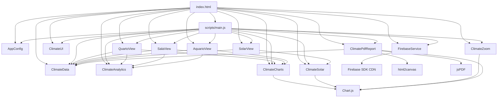
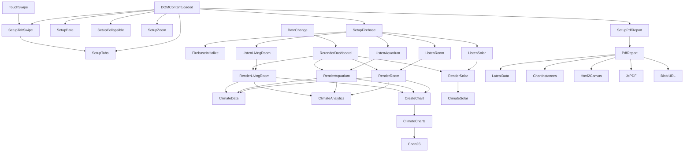

# DEPENDENCY_MAP

## Diagrama Geral

## index.html

Responsabilidade: definir DOM, containers, abas, canvases e ordem dos scripts.

Dependencias diretas: CDN Chart.js, scripts locais, Google Fonts, `style.css`.

Dependencias indiretas: todas as dependencias dos scripts.

Quem chama: navegador.

Quem e chamado: todos os scripts.

Impacto da alteracao: Critico. IDs e ordem dos scripts afetam toda a aplicacao.

## package.json

Responsabilidade: expor comandos locais de manutencao.

Dependencias diretas: Node.js local.

Quem chama: desenvolvedor.

Quem e chamado: `tools/validate-project.mjs`.

Impacto da alteracao: Baixo. Nao altera runtime da pagina.

## tools/validate-project.mjs

Responsabilidade: validar sintaxe dos scripts de forma recursiva e contratos basicos entre `index.html` e `scripts/config.js`.

Dependencias diretas: modulos nativos Node.js (`fs`, `path`, `vm`, `url`).

Quem chama: `npm run validate` ou `node tools/validate-project.mjs`.

Quem e chamado: nenhum modulo da aplicacao em runtime.

Impacto da alteracao: Baixo a Medio. Pode detectar quebras de ids, referencias locais ou sintaxe antes de abrir a pagina.

## style.css

Responsabilidade: manifesto de imports dos estilos modulares em `styles/`.

Dependencias diretas: arquivos `styles/*.css`.

Dependencias indiretas: classes e ids do HTML; estados criados por JS (`is-collapsed`, `active`, `chart-message`, etc.).

Quem chama: navegador.

Quem e chamado: nenhum modulo JS.

Impacto da alteracao: Medio a Alto, dependendo do seletor.

## styles/*.css

Responsabilidade: estilo visual separado por responsabilidade.

Arquivos:

- `tokens.css`: variaveis visuais.
- `base.css`: reset e base.
- `header.css`: header, relogio e indicador astronomico.
- `layout.css`: wrapper principal.
- `tabs-toolbar.css`: abas, toolbar, seletor de data e exportacao.
- `feedback.css`: loading, transicoes, mensagens.
- `stats.css`: cards de estatisticas.
- `charts.css`: cards e canvases de graficos.
- `advanced-views.css`: colapsaveis, visualizacoes climaticas e heatmaps.
- `zoom.css`: overlay de zoom.
- `tables.css`: tabelas.
- `responsive.css`: regras mobile.

Impacto da alteracao: Medio a Alto, dependendo do arquivo e seletor.

## scripts/config.js

Responsabilidade: centralizar Firebase, paths, ids, campos, cores e faixa de conforto.

Dependencias diretas: nenhuma.

Dependencias indiretas: Firebase, DOM e views que usam seus valores.

Quem chama: `scripts/main.js`, `scripts/firebase-service.js`, `scripts/ui.js`, `scripts/zoom.js`, views, `scripts/views/solar-view.js`.

Quem e chamado: nenhum.

Impacto da alteracao: Critico. Qualquer erro em ids/paths/campos quebra leitura ou renderizacao.

## scripts/main.js

Responsabilidade: orquestrar modulos, inicializar UI/Firebase, armazenar cache `latestData`, renderizar views.

Dependencias diretas:

- `AppConfig`
- `ClimateData`
- `ClimateAnalytics`
- `ClimateSolar`
- `ClimateCharts`
- `FirebaseService`
- `ClimateUI`
- `ClimateZoom`
- `QuartoView`
- `AquarioView`
- `SalaView`
- `SolarView`

Dependencias indiretas: Chart.js, Firebase SDK, DOM.

Quem chama: navegador via script e `DOMContentLoaded`.

Quem e chamado:

- `FirebaseService.initialize`
- `FirebaseService.listenToPath`
- `ClimateUI.setupTabs`
- `ClimateUI.setupTabSwipe`
- `ClimateUI.setupDateControls`
- `ClimateUI.setupCollapsibleSections`
- `ClimateZoom.setup`
- `ClimatePdfReport.setup`
- `ClimateSolar.getSolarEventsForSelectedDate`
- views.

Impacto da alteracao: Critico.

## scripts/firebase-service.js

Responsabilidade: carregar SDK Firebase, conectar database, criar listeners, controlar loading.

Dependencias diretas:

- `AppConfig.firebase`
- Firebase SDK CDN
- DOM `#loadingBar`

Dependencias indiretas: Realtime Database.

Quem chama: `scripts/main.js`.

Quem e chamado: Firebase SDK (`initializeApp`, `getDatabase`, `ref`, `onValue`).

Impacto da alteracao: Critico.

## scripts/data-utils.js

Responsabilidade: utilitarios de data, filtro, tabela e extracao de series.

Dependencias diretas: DOM para tabelas.

Dependencias indiretas: formato de dados Firebase.

Quem chama: `scripts/main.js`, views, `scripts/chart-utils.js`, `scripts/analytics.js`, `scripts/solar.js`, `scripts/views/solar-view.js`, `scripts/ui.js`.

Quem e chamado: nenhum modulo externo.

Impacto da alteracao: Alto.

## scripts/chart-utils.js

Responsabilidade: defaults Chart.js, grafico de linha, faixa de conforto, merge de opcoes.

Dependencias diretas:

- `Chart`
- `ClimateData`

Quem chama: `scripts/main.js`.

Quem e chamado: Chart.js.

Impacto da alteracao: Alto.

## scripts/analytics.js

Responsabilidade: estatisticas e heatmaps.

Dependencias diretas: DOM.

Dependencias indiretas: estrutura de dados Firebase, ids de containers passados por views.

Quem chama: views.

Quem e chamado: nenhum modulo local.

Impacto da alteracao: Alto para cards e visualizacoes climaticas.

## scripts/solar.js

Responsabilidade: extrair eventos solares e criar graficos solares.

Dependencias diretas:

- `ClimateData`
- `Chart`

Quem chama: `scripts/main.js`, `scripts/views/solar-view.js`, `scripts/zoom.js`.

Quem e chamado: Chart.js.

Impacto da alteracao: Alto.

## scripts/ui.js

Responsabilidade: estados vazios, mensagens, tabelas, tabs, swipe touch entre abas, colapsaveis, date picker.

Dependencias diretas:

- DOM
- `ClimateData`
- `AppConfig` em `renderStartupError`
- `localStorage`

Quem chama: `scripts/main.js`, views, `scripts/views/solar-view.js`.

Quem e chamado: nenhum modulo externo.

Impacto da alteracao: Medio a Alto.

## scripts/zoom.js

Responsabilidade: zoom dos graficos.

Dependencias diretas:

- DOM
- Chart.js
- `AppConfig.ids.charts.solarToday`
- `ClimateSolar.solarDayBackgroundPlugin`

Quem chama: `scripts/main.js`.

Quem e chamado: Chart.js.

Impacto da alteracao: Medio.

## scripts/pdf-report.js

Responsabilidade: exportar PDF A4 ou JSON da aba ativa usando dados e graficos ja carregados.

Observacoes:

- tabela exportada usa `Horario`, `Indicador`, `Valor` e `Status`
- unidade e formatada junto ao valor
- layout do PDF prioriza graficos em coluna unica para reduzir cortes em A4 retrato
- exportacao JSON inclui metadados, resumo, tabela e dados brutos filtrados

Dependencias diretas:

- DOM
- `html2canvas`
- `jsPDF`
- Blob/URL nativos do navegador para JSON
- `AppConfig`
- `ClimateData`
- `ClimateUI.getActiveTabName`
- `latestData` recebido via `scripts/main.js`
- `chartInstances` recebido via `scripts/main.js`

Quem chama: `scripts/main.js`.

Quem e chamado: html2canvas para captura do relatorio, jsPDF para montagem manual das paginas e Blob/URL para download JSON.

Impacto da alteracao: Medio a Alto. Pode afetar exportacao PDF/JSON, captura de graficos e download.

## scripts/views/quarto-view.js

Responsabilidade: renderizar Quarto.

Dependencias diretas:

- `AppConfig.ids`
- `AppConfig.fields.room`
- `ClimateData`
- `ClimateAnalytics`
- `createChart` recebido de `scripts/main.js`
- `ClimateUI`

Quem chama: `scripts/main.js`.

Impacto da alteracao: Medio.

## scripts/views/sala-view.js

Responsabilidade: renderizar Sala.

Dependencias diretas:

- `AppConfig.ids`
- `AppConfig.fields.livingRoom`
- `ClimateData`
- `ClimateAnalytics`
- `createChart`
- `ClimateUI`

Quem chama: `scripts/main.js`.

Impacto da alteracao: Medio.

## scripts/views/aquario-view.js

Responsabilidade: renderizar Aquario.

Dependencias diretas:

- `AppConfig.ids`
- `AppConfig.fields.aquarium`
- `ClimateData`
- `ClimateAnalytics`
- `createChart`
- `ClimateUI`

Quem chama: `scripts/main.js`.

Impacto da alteracao: Medio.

## scripts/views/solar-view.js

Responsabilidade: renderizar graficos solares.

Dependencias diretas:

- `AppConfig.ids`
- `ClimateData`
- `ClimateSolar`
- `ClimateUI`
- `chartInstances`

Quem chama: `scripts/main.js`.

Impacto da alteracao: Alto para solar.

## Call Graph

## Mapa de Impacto

### `scripts/config.js`

Responsabilidade: contratos centrais.

Pode quebrar: todos os renders, Firebase, ids DOM, campos.

Dependencias afetadas: praticamente todos os modulos.

Nivel: Critico.

### `scripts/data-utils.js`

Responsabilidade: formato dos dados.

Pode quebrar: graficos, tabelas, filtros, datas.

Nivel: Alto.

### `scripts/analytics.js`

Responsabilidade: estatisticas e heatmaps.

Pode quebrar: cards, heatmaps de Sala/Quarto.

Nivel: Alto.

### `scripts/solar.js`

Responsabilidade: graficos solares.

Pode quebrar: ciclo solar, historico solar e zoom solar.

Nivel: Alto.

### `index.html`

Responsabilidade: ids e ordem de scripts.

Pode quebrar: carregamento inteiro, views, CSS.

Nivel: Critico.
